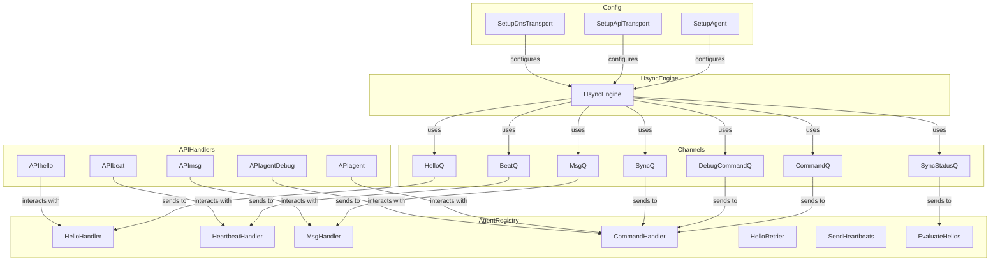

# TDNS-AGENT

**TDNS-AGENT** is a slightly more limited version of **TDNS-SERVER**.
Primarily the limitation is that it is only able to operate as a
secondary, not a primary. The intent is to enable zones that have a
well-working zone production pipeline to easily attach the
*tdns-agent* as an additional secondary and thereby gain access to the
TDNS features without the need to modify the zone production.

Design constraints for the TDNS Agent:

1. Essentially all configuration errors should be fatal. There is no
   point to an agent that is running on a partially broken config.

2. The **tdns-agent** can only serve secondary zones. Any primary zone in the
   configuration should cause the agent to terminate.

3. Can not make modifications to zones. I.e. the options
   online-signing, publish-key, allow-updates and allow-child-updates are errors and
   should cause the agent to terminate.

4. What the agent CAN do is to detect changes to delegation
   information and when that happens take action. Depending on what
   schemes the parent supports the action is either to send a generalized
   NOTIFY or create, sign and send a DNS UPDATE.

5. Not having either of the options delegation-sync-parent and/or
   delegation-sync-child for a zone is an error, as then there is no
   point to the agent being configured to deal with that zone.

