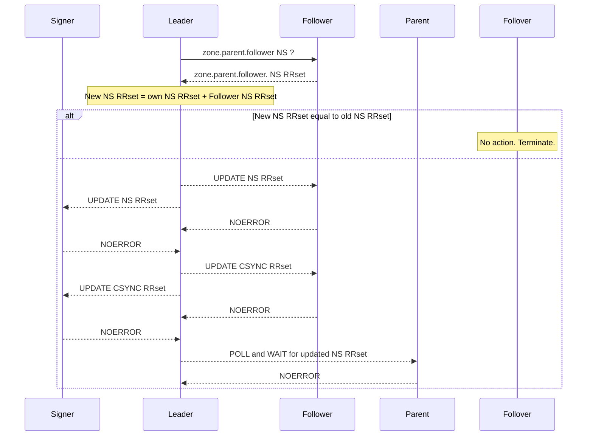

Lorem ipsum

```mermaid
sequenceDiagram
    participant Signer
    participant Leader
    participant Follower
    participant Parent
    Leader->>Follower: zone.parent.follower NS ?
    Follower-->>Leader: zone.parent.follower. NS RRset
    Note over Leader: New NS RRset = own NS RRset + Follower NS RRset
    alt New NS RRset equal to old NS RRset
       Note over Follover: No action. Terminate.
    else
       Leader-->>Follower: UPDATE NS RRset
       Leader-->>Signer: UPDATE NS RRset
       Follower-->>Leader: NOERROR
       Signer-->>Leader: NOERROR
       Leader-->>Follower: UPDATE CSYNC RRset
       Leader-->>Signer: UPDATE CSYNC RRset
       Follower-->>Leader: NOERROR
       Signer-->>Leader: NOERROR
       Leader-->>Parent: POLL and WAIT for updated NS RRset
       Parent-->>Leader: NOERROR
   end

```

Lorem ipsum
